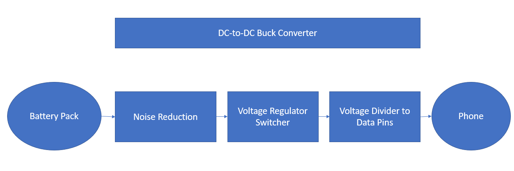
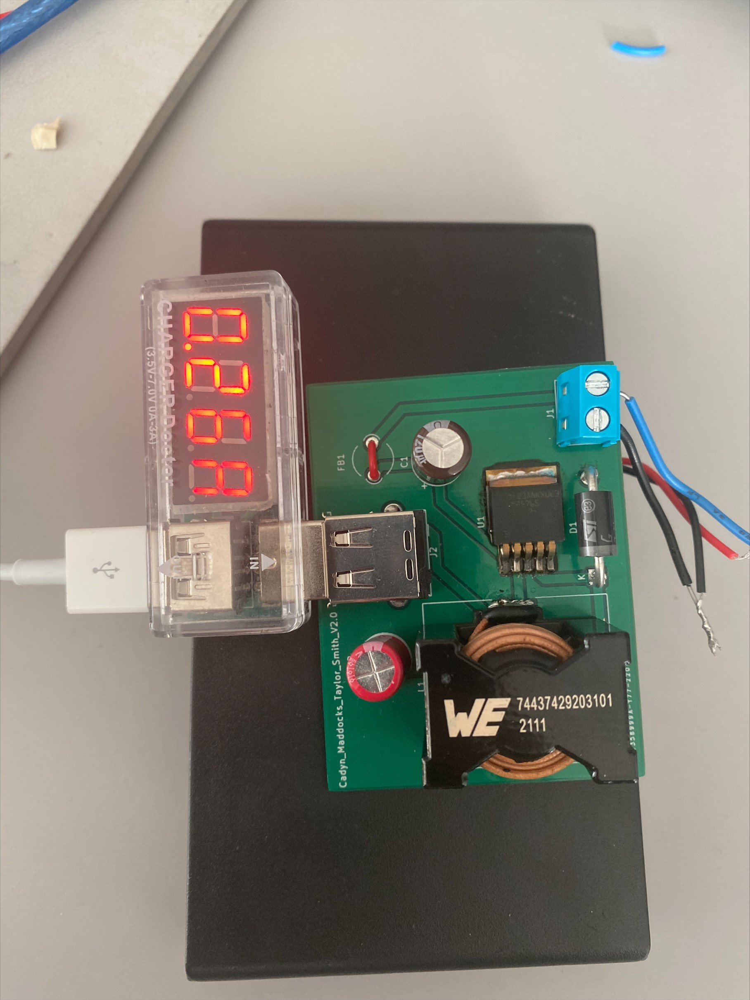

# DC-to-DC-Converter
## Overview

This is a DC-to-DC Converter Design for Walla Walla University's Power Electronics Course. The goal of this project was to create a 12-15V to 5V DC converter in order to be able to charge a phone from a voltage source ranging from 12-15V. Shown above is the block diagram with the general design of our converter. 
## Design Specifications
1. Takes a 12-15V input and outputs a 5V up to 3A
2. Is able to charge both Android Devices as well as Iphones
3. Board size is to be 10cm by 10cm
4. Efficieny of 80% or above
5. Cost less than $25
## Schematic

Shown above is ou final schematic for our project. Our input is delived from a 12-15V source to the screw terminal. For our final version we used a set of 8 AA batteries to generate 12V into the screw terminal. The input then passes a ferrite bead in order to limit noise coming from the input. It then passes into a LM25765-5 Buck Converter. The LM25765 works as a simple switcher in conjuction with our inductor and schottky diode in order to create an average duty cyle of 5V. This 5V is then passed into a voltage divider, to get 2 and 2.5 V in order to use the data pins on the USB output. From the USB 5V are generated with a current ranging from about 20-30mA.

Shown here is the voltage divider used to power the data pins. The data pins had to be given a 2.75V on the D+ pin and 2V on the D-.
## PCB Design

Shown above is the PCB design. For our design we choose to make all our components through hole in order to make building, testing, and debugging easily approachable.
## Simulations

Shown above is the simulation of the voltage response of our DC-to-DC converter under load. We used the WEBENCH tool from Texas Instruments for our simulations. The simulation is limited by its time frame but the time frame cannot be adjusted to show further. It does demonstrate the duty cycle of the circuit. 
## Board Build Up Plan
1.	Take inventory of all parts
2.	Determine Correct Values for Components
3.	Inspect PCB for defects
4.	Solder Parts to board
a.	Use one board until it works or there is an error impending continued work on that board.
b.	Use KiCAD’s HTML BOM feature in order to assist with building the board
5.	Check board amperage.
6.	Test output voltage by inputting power from DC Power Supply.
7.	Use load resistor to test output voltage.
8.	Solder Battery Pack to Terminal Screw Input
9.	Use a charge doctor and a phone to connect and test output voltage and current
10.	Should having a working board at this point. 
## Results

These images show the results we obtained when the board was built and tested by use a 8 AA battery back for its input source and then connected to an IPhone charger. Also shown is the back side of the board where we attached our resistor divider. This allowed for the IPhone to be charged, while an Android device could have worked without the data pins. We did achieve a 5V output, and we observed a 20-30mA current to our phone. The reason for this current may be due to loss charge of in the batteries over testing. 

